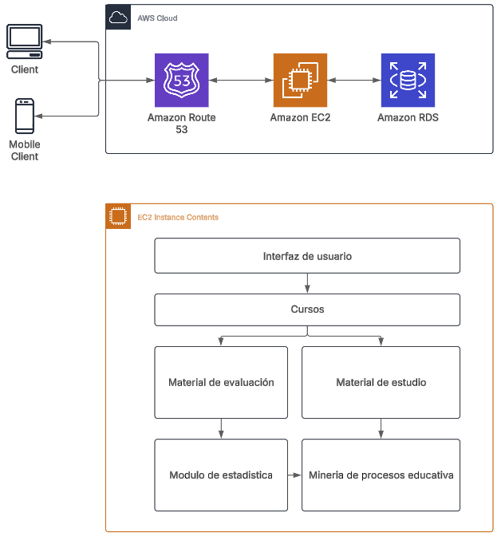
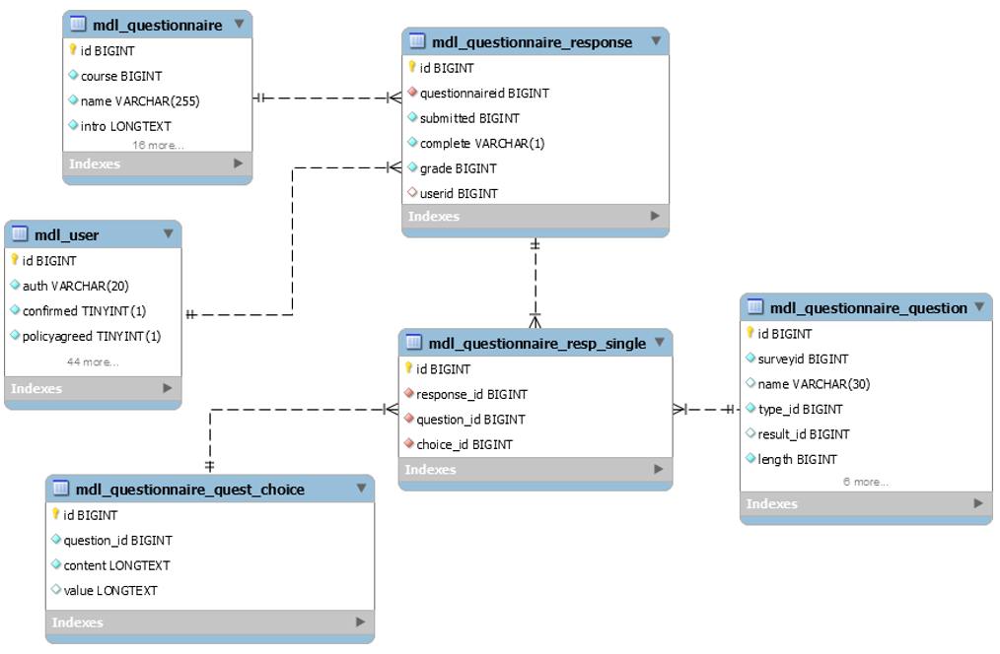

# Overview: Problema a resolver
Descripcion
## Alcance
Está diseñado para estudiantes que quieren reforzar sus conocimientos, ya sea que tengan dudas en ciertas áreas o necesiten una guía para repasar todo el contenido. A lo largo del curso, tendrás acceso a explicaciones detalladas, ejercicios interactivos, y tests prácticos para evaluar tu progreso.
Pueden ser estudiantes de secundaria en adelante, principalmente mexicanos, sin embargo al ser contenido de matemáticas en idioma español, podría ser visitado desde varios países.  

## Caso de uso

## Arquitectura
1- Contenido temático del curso (Diseño curricular)   
2- Material digital de estudio (Que atienda a los diferentes estilos de aprendizaje del alumno)     
3- Programa de actividades   
4- Actividades de reforzamiento con retroalimentación   
5- Programa de evaluaciones   
6- Logueo   
7- Minería de procesos educativos (Que permita identificar la "ruta ideal de aprendizaje")    
8- Estadísticas (Se debe revisar las actividades con las que cumple el alumno, si aprendió el tema o no, calificaciones individuales y grupales, promedio individual y grupal, etc.)      

### Diagramas

     

### Modelo de datos

## Limitaciones
asdasdad
## Costo
Considerando que inicialmente solo existirá un curso con una duración aproximada de 6 meses se estima que los costos de utilizar el servicio de AWS asienden a $60 USD
